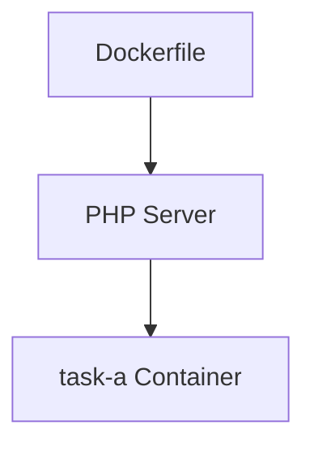

## Build the Docker image



```
docker build -t task-a .
```

## Run the container

```
docker run -p 80:80 -d task-a
```

## Stop the container

```
docker stop task-a
```

## Remove the container

```
docker rm task-a
```
