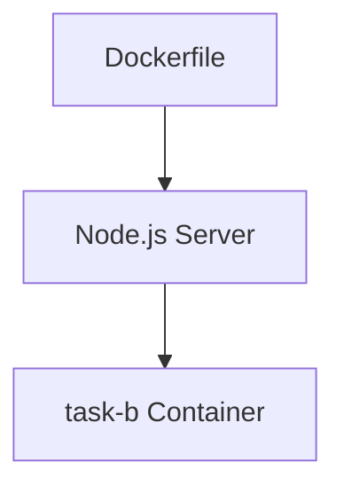

## Build the Docker image



```
docker build -t task-b .
```

## Run the container

```
docker run -p 3000:3000 -d task-b
```

## Stop the container

```
docker stop task-b
```

## Remove the container

```
docker rm task-b
```
