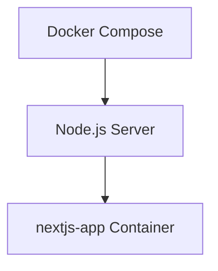

# Task C



## Build Docker Image

```
docker build -t task-c .
```

## Run Docker Container

```
docker run -p 3000:3000 -d task-c
```

## Stop Docker Container

```
docker stop task-c
```

```

```
